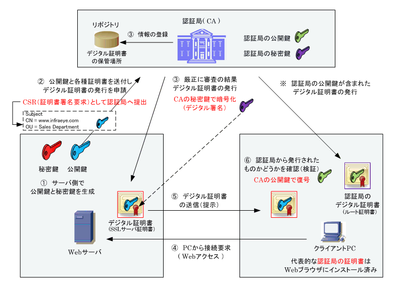
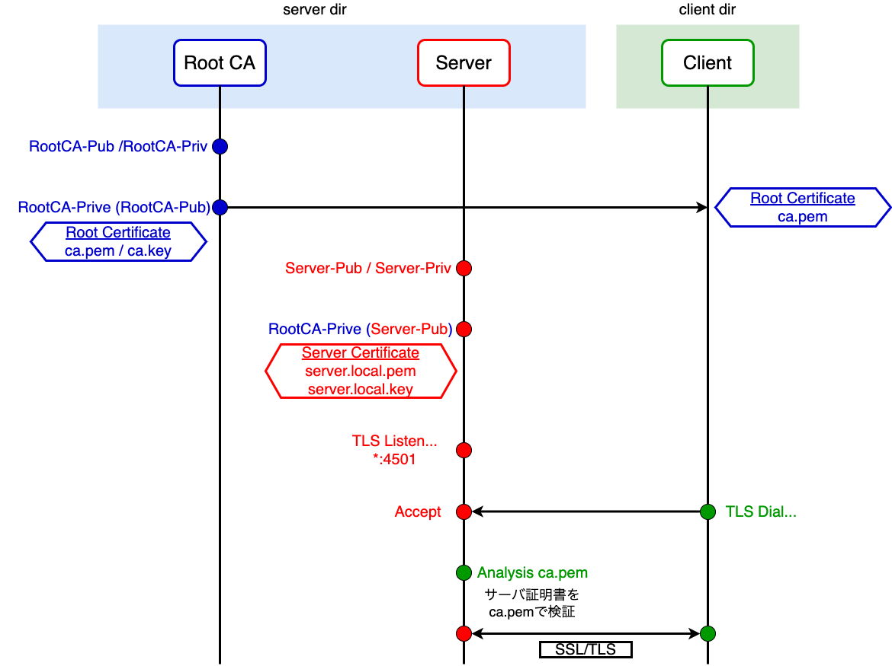

## Certificates and Keys
| 鍵の種類 | 説明 |
| :--- | :--- |
| `ca.pem` | ルート証明書（RSA公開鍵証明書） |
| `ca.key` | ルート証明書のRSA秘密鍵 |
| `server.local.pem` | サーバ証明書（RSA公開鍵証明書） |
| `server.local.key` | サーバ証明書のRSA秘密鍵 |

## PKI architecture

## Algorithm
- 1. ルート認証局の構築
  - ルート認証局用のRSAキーペアを生成
  - 公開鍵を自身の秘密鍵で署名して、ルート証明書（公開鍵デジタル証明書）を発行（オレオレ証明書）=> ルート認証局が保持
  - クライアントにルート証明書を配布
- 2. サーバ証明書を発行
  - サーバ用のRSAキーペアを生成
  - 公開鍵をルート認証局の秘密鍵で署名して、サーバ証明書（公開鍵デジタル証明書）を発行 => サーバが保持
- 3. TLS通信
  - クライアントはサーバに対してリクエストを送信
  - クライアントはルート証明書を用いてサーバ証明書（公開鍵証明書）を検証
  - 検証が正常に終了すると、TLSコネクションを確立

## TLS communication flow

